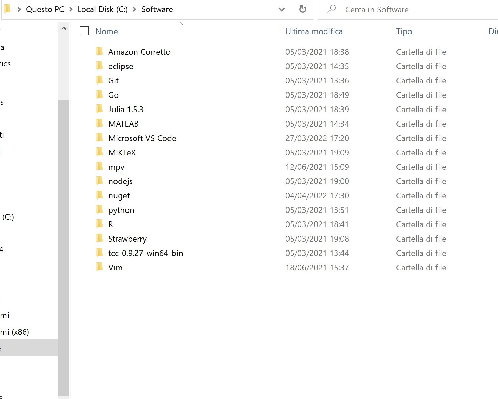

# win-config

An opinionated way to configure a Windows system with zero compromises.

- C:\Datas: storing Datas
- C:\Git: storing Git reposistories
- C:\Software: directories of installed programs

## Debloat Windows

- [Windows10Debloater](https://github.com/Sycnex/Windows10Debloater)

As admin,

```powershell
# Check if it's restricted
Get-ExecutionPolicy 
# Execution policy
Set-ExecutionPolicy AllSigned
```

## Software to Install




- Utilities: Windows Terminal, Brave browser
- Editors: Neovim, VSCode, Eclipse
- Multimedia: mpv, ffmpeg, pandoc, yt-dlp, SumatraPDF, Xournalpp, OBS, Draw.io, [PDFtk](https://www.pdflabs.com/tools/pdftk-the-pdf-toolkit/), CDBurnerXp, rufus, qBittorrent, Emule, 7-Zip, Mp3tag
- Dev: Strawberry Perl, MinGW, cmake, tcc, git, MiKTeX, Python, Anaconda, Julia, golang, R, Node.js, Docker, JDK Corretto, [the Build Tools for Visual Studio](https://www.jaacostan.com/2019/12/rust-error-linker-linkexe-not-found.html#:~:text=While%20compiling%20Rust%20program%20in,Tools%20for%20Visual%20Studio%202019)
- Package Managers: npm, pip, nuget, winget, Scoop, Chocolatey
- Other: MkDocs, Hugo, WinRar, Google Earth Pro, Stellarium, QCAD
- Browser extensions: I don't care about cookies, Unhook, Shazam, instagram story hider, insta feed eradicator
- [Remove Quick Access bloat](https://www.minitool.com/news/windows-11-quick-access.html)

## Examples

This allows me to perform certain tasks from the command line.

- Download as mp3

```powershell
yt-dlp --extract-audio --audio-format mp3 https://www.youtube.com/watch?v=VideoHash
```

- Convert from mkv to mp4 (valid for other formats as well)

```powershell
ffmpeg -i filename.mkv filename.mp4
```
