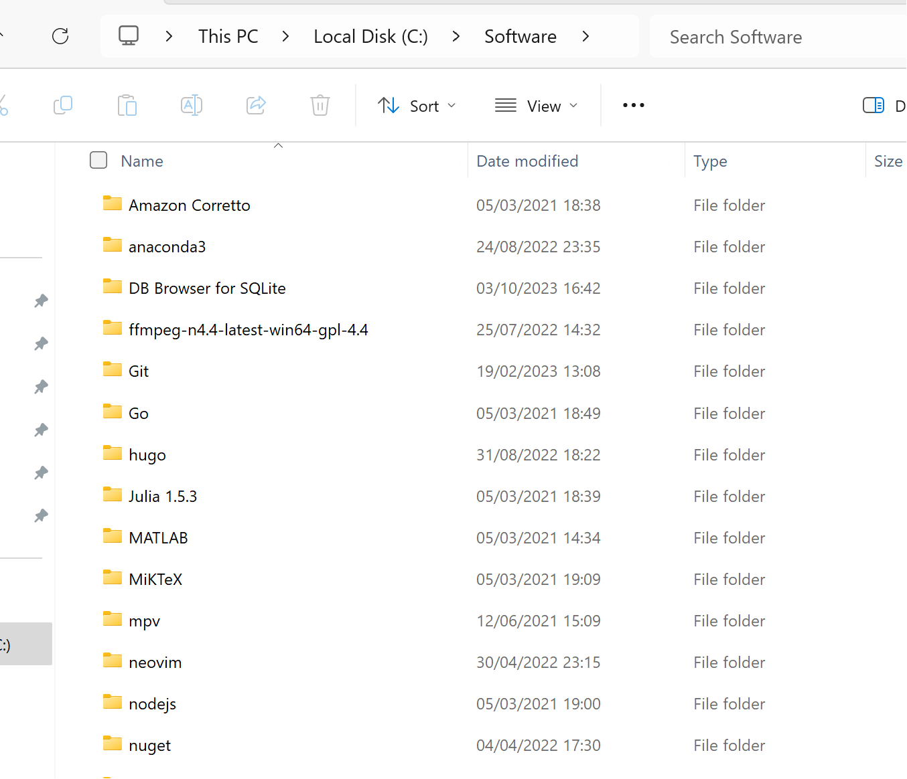
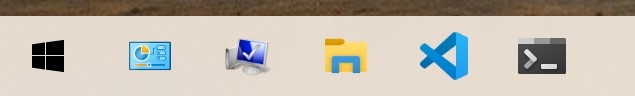

# win_config

An opinionated way to configure a Windows system with zero compromises.

- C:\Datas: storing Datas (optional)
- C:\Git: storing Git reposistories
- C:\Software: directories of installed programs

## Debloat Windows

- [Windows10Debloater](https://github.com/Sycnex/Windows10Debloater)

As admin,

```powershell
# Check if it's restricted
Get-ExecutionPolicy 
# Execution policy
# Set-ExecutionPolicy AllSigned
Set-ExecutionPolicy Unrestricted
```

## Software to Install




### 🌐 Utilities
- **Windows Terminal**
- **Brave Browser**

### 📝 Editors
- **Neovim**
- **R-Studio**
- **VSCode**
- **Eclipse**

### 🎥 Multimedia
- **mpv**, **SumatraPDF** 
- [**ImageMagick**](https://imagemagick.org/index.php)
- **ffmpeg**, **pandoc**, **yt-dlp**
- [**PDFtk**](https://www.pdflabs.com/tools/pdftk-the-pdf-toolkit/)
- **Xournalpp**, **OBS**, **Draw.io**, **Inkscape**, **GIMP**
- **CDBurnerXP**, **rufus**
- **qBittorrent**, **Emule**
- **7-Zip**, **Mp3tag**
- [**Ardour**](https://ardour.org/)
- [**GUITAR PRO**](https://www.guitar-pro.com/)

### 💻 Development Tools
- **Strawberry Perl**, **MinGW**, **cmake**, **tcc**
- **git**, **MiKTeX**, **Python**, **Anaconda**
- **Julia**, **golang**, **R**, **Node.js**
- **Docker**, **JDK Corretto**
- [**Build Tools for Visual Studio**](https://www.jaacostan.com/2019/12/rust-error-linker-linkexe-not-found.html#:~:text=While%20compiling%20Rust%20program%20in,Tools%20for%20Visual%20Studio%202019)

### 📦 Package Managers
- **npm**, [**pip**](https://bootstrap.pypa.io/get-pip.py)
- **nuget**, **winget**, **Scoop**, **Chocolatey**

### 🌟 Other Tools
- **MkDocs**, **Hugo**, **WinRar**
- **Google Earth Pro**, **Stellarium**, **QCAD**

### 🔗 Useful Links
- [**Override Windows Store Python issue**](https://superuser.com/questions/1770299/override-windows-store-open-action-when-launching-python-in-powershell)
- [**Remove Quick Access bloat in Windows 11**](https://www.minitool.com/news/windows-11-quick-access.html)

### 🌐 Browser Extensions
- I don't care about cookies, Unhook, Shazam
- Instagram story hider, Insta feed eradicator

### Android apps
- shizuku, canta, f-droid
- [adb](https://developer.android.com/tools/releases/platform-tools)

## Other interesting scripts

- [NotCPUCores](https://github.com/rcmaehl/NotCPUCores)
- [Sophia-Script-for-Windows](https://github.com/farag2/Sophia-Script-for-Windows)
- [Activation Scripts](https://github.com/massgravel/Microsoft-Activation-Scripts)
- [Windows10Debloater](https://github.com/Sycnex/Windows10Debloater)
- [Win11Debloat](https://github.com/Raphire/Win11Debloat)
- [tiny11](https://github.com/ntdevlabs/tiny11builder)

## Examples

This allows me to perform certain tasks from the command line.

- Download as mp3

```powershell
yt-dlp --extract-audio --audio-format mp3 https://www.youtube.com/watch?v=VideoHash
```

- Convert from mkv to mp4 (valid for other formats as well)

```powershell
ffmpeg -i filename.mkv filename.mp4
```
